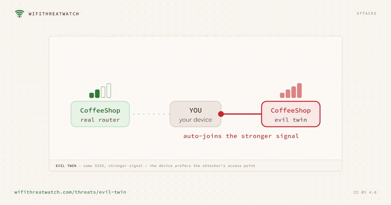
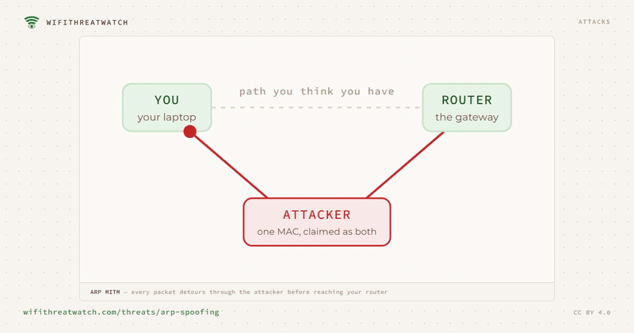
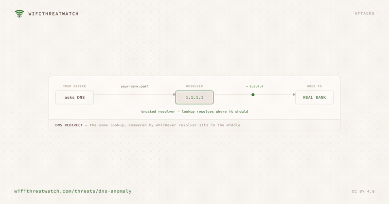
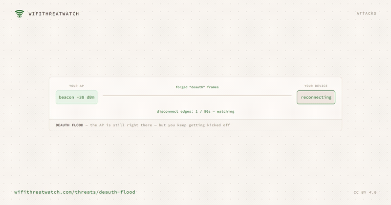
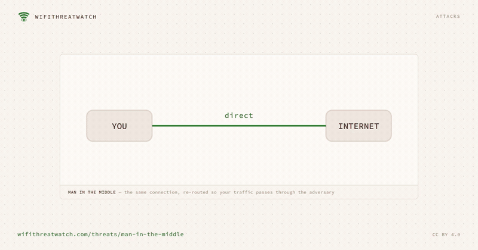
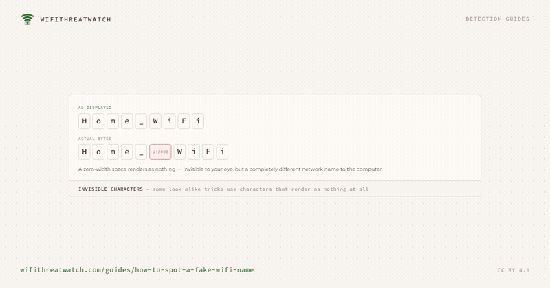

# WiFi attack diagrams

68 original, plain-language diagrams explaining how WiFi attacks work
and how they are detected — ARP spoofing, evil-twin access points, rogue DHCP
servers, DNS hijacking, deauthentication floods, IPv6 router spoofing and more.

**61 of them animate.** Every diagram ships three ways: a still PNG, an
animated GIF, and an MP4.

**Licence: [CC BY 4.0](https://creativecommons.org/licenses/by/4.0/).** Use them in
talks, courses, blog posts, documentation — commercially or not. The only
requirement is credit.

---

## A few of them

### Evil Twin



Same SSID, stronger signal — the device prefers the attacker's access point. → [How it works](https://wifithreatwatch.com/threats/evil-twin)

### ARP MITM



Every packet detours through the attacker before reaching your router. → [How it works](https://wifithreatwatch.com/threats/arp-spoofing)

### DNS Redirect



The same lookup, answered by whichever resolver sits in the middle. → [How it works](https://wifithreatwatch.com/threats/dns-anomaly)

### Deauth Flood



The AP is still right there — but you keep getting kicked off. → [How it works](https://wifithreatwatch.com/threats/deauth-flood)

### Man in the Middle



The same connection, re-routed so your traffic passes through the adversary. → [How it works](https://wifithreatwatch.com/threats/man-in-the-middle)

### Invisible Characters



Some look-alike tricks use characters that render as nothing at all. → [How it works](https://wifithreatwatch.com/guides/how-to-spot-a-fake-wifi-name)

**[See all 68 animated on the website →](https://wifithreatwatch.com/diagrams)**

---

## Using them

```
Diagram by WifiThreatWatch — CC BY 4.0
https://wifithreatwatch.com/diagrams
```

Credit that way, or however is natural for your medium — a caption, a slide
footer, an alt attribute. Link back to the page the diagram came from where
you can; the table below lists them.

| Diagram | What it shows | Files | Explanation |
| --- | --- | --- | --- |
| **24 / 7 vs When You’re Awake** | the app watches while your PC is on — the Nano never blinks, so the 3 a.m. attack is still caught | [png](images/always-on.png) · — · — | [read](https://wifithreatwatch.com/nano) |
| **Cache vs Wire** | reading the table can't witness the poisoning happen; sniffing the wire can | [png](images/arp-cache-vs-wire.png) · [gif](animated/arp-cache-vs-wire.gif) · [mp4](video/arp-cache-vs-wire.mp4) | [read](https://wifithreatwatch.com/threats/arp-spoofing) |
| **Your Baseline + 1** | four devices you authorized — and one you didn't | [png](images/baseline-vs-stranger.png) · [gif](animated/baseline-vs-stranger.gif) · [mp4](video/baseline-vs-stranger.mp4) | [read](https://wifithreatwatch.com/guides/what-are-rogue-devices) |
| **Same Name, Two Radios** | two access points broadcasting one SSID — only one is your real router | [png](images/bssid-roster.png) · [gif](animated/bssid-roster.gif) · [mp4](video/bssid-roster.mp4) | [read](https://wifithreatwatch.com/guides/how-to-detect-an-evil-twin) |
| **The Fake Hotspot Trick** | a stranger nearby broadcasts a friendly network name and waits — WifiThreatWatch stands in the middle, warns you in plain English, and cuts him off | [png](images/coffee-shop-threat.png) · [gif](animated/coffee-shop-threat.gif) · [mp4](video/coffee-shop-threat.mp4) | [read](https://wifithreatwatch.com) |
| **Stronger, Not Louder** | every extra reporter raises one shared count — it never multiplies the warnings on your screen | [png](images/corroboration.png) · [gif](animated/corroboration.gif) · [mp4](video/corroboration.mp4) | [read](https://wifithreatwatch.com/shared-intelligence) |
| **Two Kinds of Cover** | a VPN encrypts the line; WifiThreatWatch watches the room the attacker is standing in | [png](images/coverage-diagram.png) · [gif](animated/coverage-diagram.gif) · [mp4](video/coverage-diagram.mp4) | [read](https://wifithreatwatch.com/compare) |
| **Deauth Flood** | the AP is still right there — but you keep getting kicked off | [png](images/deauth-flood.png) · [gif](animated/deauth-flood.gif) · [mp4](video/deauth-flood.mp4) | [read](https://wifithreatwatch.com/threats/deauth-flood) |
| **The Real Goal** | denial of service is rarely the point — it’s the setup for the twin | [png](images/deauth-to-twin.png) · [gif](animated/deauth-to-twin.gif) · [mp4](video/deauth-to-twin.mp4) | [read](https://wifithreatwatch.com/guides/how-to-detect-a-deauth-attack) |
| **One Verified Alert** | an evil twin and a gateway ARP spoof are often one attack — we de-duplicate them so you act once | [png](images/dedup-alert.png) · [gif](animated/dedup-alert.gif) · [mp4](video/dedup-alert.mp4) | [read](https://wifithreatwatch.com/threats/evil-twin) |
| **Layered Defense** | awareness is the first line — if you connect to the impostor anyway, two more layers are waiting | [png](images/defense-layers.png) · [gif](animated/defense-layers.gif) · [mp4](video/defense-layers.mp4) | [read](https://wifithreatwatch.com/threats/homoglyph-ssid) |
| **ARP Cache** | airline-lounge net — one IP’s hardware address kept flipping (~37 devices present) | [png](images/den-arp-flip.png) · [gif](animated/den-arp-flip.gif) · [mp4](video/den-arp-flip.mp4) | [read](https://wifithreatwatch.com/blog/denver-airport-wifi-security-scan) |
| **Encryption Audit** | every airport network the scan saw was open — no WiFi-layer encryption | [png](images/den-open-networks.png) · [gif](animated/den-open-networks.gif) · [mp4](video/den-open-networks.mp4) | [read](https://wifithreatwatch.com/blog/denver-airport-wifi-security-scan) |
| **SSID Roster** | 73 access points, one network name — 52 recognized, 18 suspicious BSSID, 3 evil-twin-nearby | [png](images/den-ssid-roster.png) · [gif](animated/den-ssid-roster.gif) · [mp4](video/den-ssid-roster.mp4) | [read](https://wifithreatwatch.com/blog/denver-airport-wifi-security-scan) |
| **Snapshot vs. Watch** | a snapshot sees one moment; a watch sees the moment it joins | [png](images/detection-ladder.png) · [gif](animated/detection-ladder.gif) · [mp4](video/detection-ladder.mp4) | [read](https://wifithreatwatch.com/guides/what-are-rogue-devices) |
| **One Device vs the Whole Network** | the app guards the machine it runs on — the Nano watches everything on the WiFi, installed or not | [png](images/device-vs-network.png) · — · — | [read](https://wifithreatwatch.com/nano) |
| **Passive DHCP Watch** | every OFFER and ACK checked against the one legitimate server — a stranger stands out | [png](images/dhcp-watch.png) · — · — | [read](https://wifithreatwatch.com/guides/how-to-detect-a-rogue-dhcp-server) |
| **Resolver Baseline** | a resolver you didn’t set, on a network you didn’t change — that’s the anomaly | [png](images/dns-baseline-check.png) · [gif](animated/dns-baseline-check.gif) · [mp4](video/dns-baseline-check.mp4) | [read](https://wifithreatwatch.com/guides/how-to-detect-dns-hijacking) |
| **DNS Answer Integrity** | the resolver IP looks the same — the answer is what gives it away | [png](images/dns-canary.png) · [gif](animated/dns-canary.gif) · [mp4](video/dns-canary.mp4) | [read](https://wifithreatwatch.com/threats/dns-spoofing) |
| **DNS Redirect** | the same lookup, answered by whichever resolver sits in the middle | [png](images/dns-redirect.png) · [gif](animated/dns-redirect.gif) · [mp4](video/dns-redirect.mp4) | [read](https://wifithreatwatch.com/threats/dns-anomaly) |
| **Suppression Gate** | a resolver change we caused ourselves is not an attack | [png](images/dns-signal.png) · [gif](animated/dns-signal.gif) · [mp4](video/dns-signal.mp4) | [read](https://wifithreatwatch.com/threats/dns-anomaly) |
| **Escalation** | a new device is informational — until it acts like an attacker, and the same detection turns critical | [png](images/escalation.png) · [gif](animated/escalation.gif) · [mp4](video/escalation.mp4) | [read](https://wifithreatwatch.com/threats/rogue-device) |
| **Evil Twin** | same SSID, stronger signal — the device prefers the attacker's access point | [png](images/evil-twin-lure.png) · [gif](animated/evil-twin-lure.gif) · [mp4](video/evil-twin-lure.mp4) | [read](https://wifithreatwatch.com/threats/evil-twin) |
| **One Foothold, Whole Map** | a hostile device quietly maps the network and reads what flows past | [png](images/foothold-spread.png) · [gif](animated/foothold-spread.gif) · [mp4](video/foothold-spread.mp4) | [read](https://wifithreatwatch.com/guides/what-are-rogue-devices) |
| **Same Entry, Two Identities** | a device list shows the row — not which one it is | [png](images/freeloader-vs-attacker.png) · [gif](animated/freeloader-vs-attacker.gif) · [mp4](video/freeloader-vs-attacker.mp4) | [read](https://wifithreatwatch.com/guides/is-someone-on-my-wifi-windows) |
| **Sealed Path** | the attacker made itself your gateway and DNS — so all it gets to forward is ciphertext it can’t read | [png](images/gateway-bypass.png) · [gif](animated/gateway-bypass.gif) · [mp4](video/gateway-bypass.mp4) | [read](https://wifithreatwatch.com/threats/rogue-dhcp) |
| **ARP MITM** | the route you assume vs. the one you get — every packet detours through the attacker first | [png](images/howitworks-arp-detour.png) · [gif](animated/howitworks-arp-detour.gif) · [mp4](video/howitworks-arp-detour.mp4) | [read](https://wifithreatwatch.com/how-it-works) |
| **New Identity** | the adapter rolls a fresh MAC and pulls a new DHCP lease — the address the attacker was poisoning no longer exists | [png](images/howitworks-identity-reset.png) · [gif](animated/howitworks-identity-reset.gif) · [mp4](video/howitworks-identity-reset.mp4) | [read](https://wifithreatwatch.com/how-it-works) |
| **Invisible Characters** | some look-alike tricks use characters that render as nothing at all | [png](images/invisible-chars.png) · [gif](animated/invisible-chars.gif) · [mp4](video/invisible-chars.mp4) | [read](https://wifithreatwatch.com/guides/how-to-spot-a-fake-wifi-name) |
| **Re-checked ~Every 30s** | flagged after you already joined? you’re warned in the app on the next re-check, not at your next scan | [png](images/live-recheck.png) · [gif](animated/live-recheck.gif) · [mp4](video/live-recheck.mp4) | [read](https://wifithreatwatch.com/shared-intelligence) |
| **Lock It Down** | a few minutes turns an open door into a closed one | [png](images/lockdown-sequence.png) · [gif](animated/lockdown-sequence.gif) · [mp4](video/lockdown-sequence.mp4) | [read](https://wifithreatwatch.com/guides/is-someone-on-my-wifi-windows) |
| **Mesh AP Panel** | every node broadcasting your network name — signal, load, and trust at a glance | [png](images/mesh-nodes.png) · [gif](animated/mesh-nodes.gif) · [mp4](video/mesh-nodes.mp4) | [read](https://wifithreatwatch.com) |
| **Mesh vs Twin** | your mesh uses many radios on purpose — the trick is flagging only the one that doesn’t belong | [png](images/mesh-vs-twin.png) · — · — | [read](https://wifithreatwatch.com/guides/how-to-detect-an-evil-twin) |
| **Man in the Middle** | the same connection, re-routed so your traffic passes through the adversary | [png](images/mitm-path.png) · [gif](animated/mitm-path.gif) · [mp4](video/mitm-path.mp4) | [read](https://wifithreatwatch.com/threats/man-in-the-middle) |
| **Symptom vs Frame** | Windows can only infer an attack from its symptoms — a monitor radio reads the attack frames themselves | [png](images/monitor-mode.png) · [gif](animated/monitor-mode.gif) · [mp4](video/monitor-mode.mp4) | [read](https://wifithreatwatch.com/nano) |
| **WifiThreatWatch Nano** | a small always-on sentry you plug into any Wi-Fi — two radios, no screen, never off | [png](images/nano-device.png) · [gif](animated/nano-device.gif) · [mp4](video/nano-device.mp4) | [read](https://wifithreatwatch.com/nano) |
| **Read It on Join** | the moment you connect, the app finds the Nano and reads what it has already seen — before you trust the network | [png](images/nano-handoff.png) · — · — | [read](https://wifithreatwatch.com/nano) |
| **WifiThreatWatch Nano** | a headless sensor running the same detectors 24/7 — even when your PC is asleep | [png](images/nano-sensor.png) · [gif](animated/nano-sensor.gif) · [mp4](video/nano-sensor.mp4) | [read](https://wifithreatwatch.com/shared-intelligence) |
| **It Compounds** | the database is young — every device that joins makes the next warning likelier to already be there | [png](images/network-effect.png) · [gif](animated/network-effect.gif) · [mp4](video/network-effect.mp4) | [read](https://wifithreatwatch.com/shared-intelligence) |
| **See Threats Before You Join** | every nearby network checked against the shared database — before you tap connect | [png](images/network-reputation.png) · [gif](animated/network-reputation.gif) · [mp4](video/network-reputation.mp4) | [read](https://wifithreatwatch.com/shared-intelligence) |
| **Answer, Not Resolver** | resolve a name whose correct IP you already know — the answer is what gives it away | [png](images/nslookup-check.png) · [gif](animated/nslookup-check.gif) · [mp4](video/nslookup-check.mp4) | [read](https://wifithreatwatch.com/guides/how-to-detect-dns-spoofing) |
| **What a Report Sends** | the attack is documented so the next device recognizes it — your browsing, files, exact location and identity stay out of it | [png](images/on-device-hash.png) · [gif](animated/on-device-hash.gif) · [mp4](video/on-device-hash.mp4) | [read](https://wifithreatwatch.com/shared-intelligence) |
| **Protect Me** | six stages in one fixed order — the encrypted tunnel comes up last, not first | [png](images/ordered-pipeline.png) · [gif](animated/ordered-pipeline.gif) · [mp4](video/ordered-pipeline.mp4) | [read](https://wifithreatwatch.com/how-it-works) |
| **Encrypted, Still Routed** | a VPN hides what you send — not the fact that an attacker is on your path | [png](images/path-vs-contents.png) · [gif](animated/path-vs-contents.gif) · [mp4](video/path-vs-contents.mp4) | [read](https://wifithreatwatch.com/guides/how-to-detect-a-man-in-the-middle-attack) |
| **ARP Timeline** | two brief blips, both randomized (LAA) MACs — consistent with MAC rotation, not a sustained attack | [png](images/pns-arp-blip.png) · [gif](animated/pns-arp-blip.gif) · [mp4](video/pns-arp-blip.mp4) | [read](https://wifithreatwatch.com/blog/pensacola-airport-wifi-security-scan) |
| **Open Segment** | 85 devices new to this laptop — everyone else in the terminal on the same open network, not 85 attackers | [png](images/pns-crowd.png) · [gif](animated/pns-crowd.gif) · [mp4](video/pns-crowd.mp4) | [read](https://wifithreatwatch.com/blog/pensacola-airport-wifi-security-scan) |
| **DNS Resolver** | PNS ran on Quad9 (9.9.9.9), which blocks known-malicious domains — a security-conscious choice | [png](images/pns-quad9.png) · [gif](animated/pns-quad9.gif) · [mp4](video/pns-quad9.mp4) | [read](https://wifithreatwatch.com/blog/pensacola-airport-wifi-security-scan) |
| **Reclaim Loop** | if the attacker re-poisons, we change identity again — up to five times — until the lock breaks | [png](images/reclaim-loop.png) · [gif](animated/reclaim-loop.gif) · [mp4](video/reclaim-loop.mp4) | [read](https://wifithreatwatch.com/threats/arp-spoofing) |
| **Reconnect Guard** | we can’t stop the radio frames — but we name the attack and treat the network offering you back as suspect | [png](images/reconnect-guard.png) · [gif](animated/reconnect-guard.gif) · [mp4](video/reconnect-guard.mp4) | [read](https://wifithreatwatch.com/threats/deauth-flood) |
| **Retry** | a new identity every attempt — up to five — until one beats the re-poison | [png](images/retry-loop.png) · [gif](animated/retry-loop.gif) · [mp4](video/retry-loop.mp4) | [read](https://wifithreatwatch.com/how-it-works) |
| **Rogue, in Buckets** | one label, four very different things | [png](images/rogue-categories.png) · [gif](animated/rogue-categories.gif) · [mp4](video/rogue-categories.mp4) | [read](https://wifithreatwatch.com/guides/what-are-rogue-devices) |
| **Rogue DHCP** | one broadcast, two answers — a second server volunteers as your gateway | [png](images/rogue-dhcp.png) · — · — | [read](https://wifithreatwatch.com/threats/rogue-dhcp) |
| **Device Roster** | a MAC the baseline has never seen is surfaced as new | [png](images/rogue-roster.png) · [gif](animated/rogue-roster.gif) · [mp4](video/rogue-roster.mp4) | [read](https://wifithreatwatch.com/threats/rogue-device) |
| **Subnet Sweep** | every host pinged at once — one MAC answers that shouldn't | [png](images/rogue-sweep.png) · [gif](animated/rogue-sweep.gif) · [mp4](video/rogue-sweep.mp4) | [read](https://wifithreatwatch.com/threats/rogue-device) |
| **Attached Devices** | every device accounted for — except one you didn't invite | [png](images/router-device-list.png) · [gif](animated/router-device-list.gif) · [mp4](video/router-device-list.mp4) | [read](https://wifithreatwatch.com/guides/is-someone-on-my-wifi-windows) |
| **Defense That Compounds** | one attack caught, reported, and turned into an early warning for the next person | [png](images/shared-signal-flow.png) · [gif](animated/shared-signal-flow.gif) · [mp4](video/shared-signal-flow.mp4) | [read](https://wifithreatwatch.com/mission) |
| **Canonical Key** | different bytes that reduce to the same key are the tell | [png](images/ssid-canon.png) · [gif](animated/ssid-canon.gif) · [mp4](video/ssid-canon.mp4) | [read](https://wifithreatwatch.com/threats/homoglyph-ssid) |
| **SSID Look-alike** | same pixels, different bytes — one letter isn't Latin | [png](images/ssid-diff.png) · [gif](animated/ssid-diff.gif) · [mp4](video/ssid-diff.mp4) | [read](https://wifithreatwatch.com/threats/homoglyph-ssid) |
| **Everyday Tells** | none prove it alone — together, worth two minutes | [png](images/symptom-checklist.png) · [gif](animated/symptom-checklist.gif) · [mp4](video/symptom-checklist.mp4) | [read](https://wifithreatwatch.com/guides/is-someone-on-my-wifi-windows) |
| **The Report vs. You** | a confirmed attack names the threat in full — and is never tied to you | [png](images/threat-report.png) · [gif](animated/threat-report.gif) · [mp4](video/threat-report.mp4) | [read](https://wifithreatwatch.com) |
| **ARP MITM** | every packet detours through the attacker before reaching your router | [png](images/threats-arp-detour.png) · [gif](animated/threats-arp-detour.gif) · [mp4](video/threats-arp-detour.mp4) | [read](https://wifithreatwatch.com/threats/arp-spoofing) |
| **Identity Reset** | a fresh MAC and IP break the attacker's lock before the tunnel comes up | [png](images/threats-identity-reset.png) · [gif](animated/threats-identity-reset.gif) · [mp4](video/threats-identity-reset.mp4) | [read](https://wifithreatwatch.com/threats/man-in-the-middle) |
| **Resolved in the Tunnel** | the same canary that came back tampered on the local network resolves correctly through Active Defense | [png](images/tunnel-answer.png) · — · — | [read](https://wifithreatwatch.com/threats/dns-spoofing) |
| **DNS on the Tunnel** | your lookups ride the encrypted tunnel to a resolver we control — the swapped local one never sees them | [png](images/tunnel-resolver.png) · [gif](animated/tunnel-resolver.gif) · [mp4](video/tunnel-resolver.mp4) | [read](https://wifithreatwatch.com/threats/dns-anomaly) |
| **Baseline Check** | the current association weighed against the saved BSSID, gateway MAC and DNS | [png](images/twin-baseline.png) · [gif](animated/twin-baseline.gif) · [mp4](video/twin-baseline.mp4) | [read](https://wifithreatwatch.com/threats/evil-twin) |
| **Two Channels, Not One** | the cloud database answers questions your device asks · the Nano announces itself only on your own WiFi | [png](images/two-channels.png) · [gif](animated/two-channels.gif) · [mp4](video/two-channels.mp4) | [read](https://wifithreatwatch.com/shared-intelligence) |
| **And** | both signals must agree before we interrupt you — a stale cache entry alone stays quiet | [png](images/two-signal-gate.png) · [gif](animated/two-signal-gate.gif) · [mp4](video/two-signal-gate.mp4) | [read](https://wifithreatwatch.com/how-it-works) |
| **No Push, No Broadcast** | a detection climbs into one shared row; the next device finds it only when it asks — devices never message each other | [png](images/warning-journey.png) · [gif](animated/warning-journey.gif) · [mp4](video/warning-journey.mp4) | [read](https://wifithreatwatch.com/shared-intelligence) |

---

## Where these come from

They were drawn for [WifiThreatWatch](https://wifithreatwatch.com), a Windows
network-security app that detects WiFi attacks on the local network — the kind
of attack that happens between your device and the router, which a VPN does not
address.

Each diagram is a React + [Framer Motion](https://www.framer.com/motion/) component
rendered on the site; the files here are captures of those. To see them running —
and to read the write-up each one belongs to — go to **[wifithreatwatch.com/diagrams](https://wifithreatwatch.com/diagrams)**.

## Regenerating

These files are generated, not hand-edited. In the website repo:

```sh
npm run figures
```

That rescans the figure components, recaptures every still, GIF and MP4, and
rewrites this repo's contents. Commit and push from `social-kit/github-repo`
afterwards — it is a separate repo from the website.
